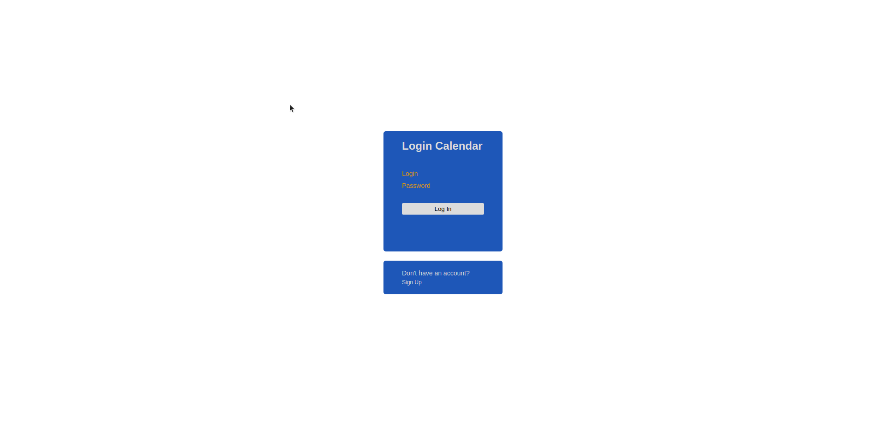
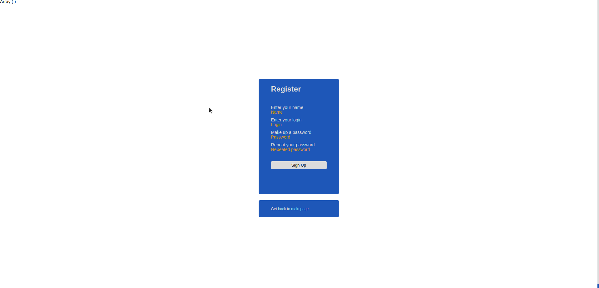
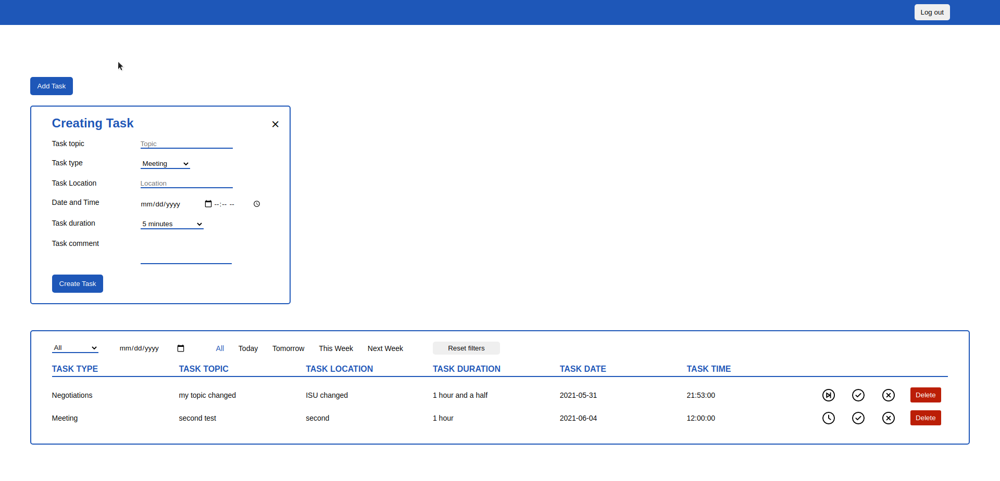

<h1>PHP проект</h1>
<h2>Календарь</h2>

Функционал:

<ul>
    <li>Авторизация</li>
    <li>Регистрация</li>
    <li>Добавление задачи</li>
    <li>Редактирование задачи</li>
    <li>Удаление задачи</li>
    <li>Сортировка задач по нескольким фильтрам одновременно</li>
</ul>

