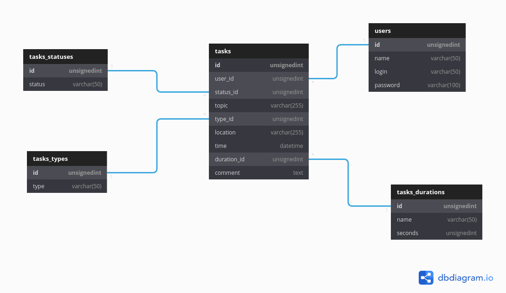

<h1>Структура и описание базы данных</h1>

<table>
    <tr>
        <td>Название табицы</td>
        <td>Описание таблицы</td>
    </tr>
    <tr>
        <td>Tasks</td>
        <td>Таблица со всеми существующими заданиями</td>
    </tr>
    <tr>
        <td>Tasks Statuses</td>
        <td>Таблица со статусами активности задания</td>
    </tr>
    <tr>
        <td>Tasks Types</td>
        <td>Таблица с типами каждого задания</td>
    </tr>
    <tr>
        <td>Tasks Durations</td>
        <td>Таблица с временными промежутками заданий</td>
    </tr>
    <tr>
        <td>Users</td>
        <td>Таблица с информацией о юзерах</td>
    </tr>
</table>